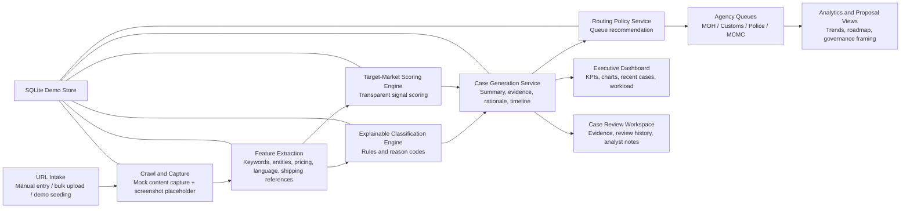

# Architecture Diagram

## Notes

- The demo uses seeded synthetic data and placeholder screenshot captures.
- All findings are framed as analyst decision-support, not enforcement automation.
- Queue routing is configuration-driven and intentionally transparent for proposal review.
